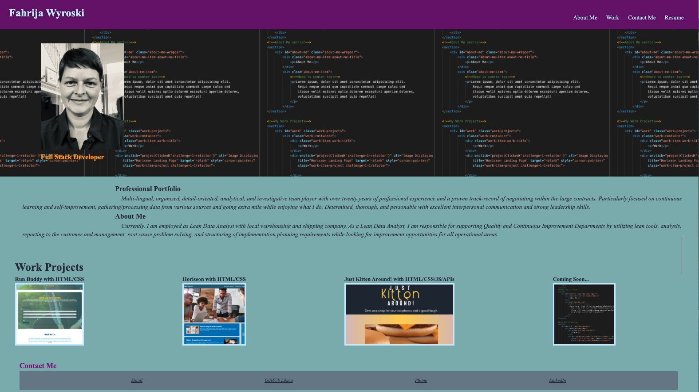

# myreact-portfolio
  ### By Likica * [Email me](mailto:fahrija_wyroski@live.com) * 
  * [Deployed Appplication](https://likica.github.io/myreact-portfolio/)
 
  ## Table of contents
  * [Description](#Description)
  * [Installation Instructions](#installation-Instructions)
  * [Usage Instructions](#Usage-Instructions)
  * [Questions](#Questions)
  * [Contributing](#Contributing)
  * [License](#License)
 
  # Description
  ##### [Back to Table of Contents](#Table-of-Contents)
  #### This Portfolio ha been created using React and Node.js. Professional portfolio includes bio, resume, contact form and contact info, as well as my projects ###

  ## User Story
  ##### [Back to Table of Contents](#Table-of-Contents)
* AS AN employer looking for candidates with experience building single-page applications
* I WANT to view a potential employee's deployed React portfolio of work samples
* SO THAT I can assess whether they're a good candidate for an open position

  ## Installation Instructions
  ##### [Back to Table of Contents](#Table-of-Contents)
  - Use URL to navigate to page
     
    

  ## Usage Instructions
  ##### [Back to Table of Contents](#Table-of-Contents)
  #### Page Navigation Tips
* Use top navigation panel to access sections of the webpage such as About Me, Work, Contact Me and my complete Resume.
* Use bottom links for contacting via emal, phone or social media LinkedIn.

  ## Contributing
  ##### [Back to Table of Contents](#Table-of-Contents)

  ## Questions
  ##### [Back to Table of Contents](#Table-of-Contents)
  * If you have any questions, please contact me at fahrija_wyroski@live.com

  ## License 
  ##### [Back to Table of Contents](#Table-of-Contents)
  * License Type: MIT
    
    [License: MIT](https://opensource.org/licenses/MIT)
    Permission is hereby granted, free of charge, to any person obtaining a copy of this software and associated documentation files (the "Software"), to deal in the Software without restriction, including without limitation the rights to use, copy, modify, merge, publish, distribute, sublicense, and/or sell copies of the Software, and to permit persons to whom the Software is furnished to do so, subject to the following conditions:The above copyright notice and this permission notice shall be included in all copies or substantial portions of the Software.THE SOFTWARE IS PROVIDED "AS IS", WITHOUT WARRANTY OF ANY KIND, EXPRESS OR IMPLIED, INCLUDING BUT NOT LIMITED TO THE WARRANTIES OF MERCHANTABILITY, FITNESS FOR A PARTICULAR PURPOSE AND NONINFRINGEMENT. IN NO EVENT SHALL THE AUTHORS OR COPYRIGHT HOLDERS BE LIABLE FOR ANY CLAIM, DAMAGES OR OTHER LIABILITY, WHETHER IN AN ACTION OF CONTRACT, TORT OR OTHERWISE, ARISING FROM, OUT OF OR IN CONNECTION WITH THE SOFTWARE OR THE USE OR OTHER DEALINGS IN THE SOFTWARE.

  _This README was generated by Likica with_ ❤️ [GitHub Profile](https://github.com/likica)
 
